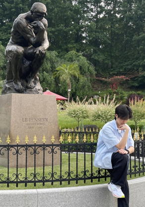

# Pray for Hana

### 시니어 종교인의 헌금·연금·신탁을 하나은행으로 연결하는 신앙 생활 도우미 금융 플랫폼

---

 

- Mock up: https://hanaro-five.vercel.app/onboarding/intro

  

### 📖프로젝트 소개

- 시니어가 '정기적으로' 모이는 **종교**: 약 13,891,768명, 단순한 예배, 미사, 수양이 아닌 “관계”와 “역할”을 원한다
- 교인 공동체의 **사회 활동** 참여를 중심으로 한 서비스 기획: 교단이나 개인 중심의 기존 유사 서비스와 다른 타겟층
- **앱테크**를 많이 하는 시니어: 캐시워크, 신한 50+ 걸어요, 토스 게임 저금통의 높은 시니어 가입율에서 착안
  

**➡️ 신앙 활동을 하면 포인트가 쌓이고, 포인트로 헌금할 수 있는 서비스 기획**

  

### 💰은행 수익성

- 퇴직연금 유치: 약 500조
- 막대한 공적연금 유치
- 가족 단위 락인
- 하나 리빙 트러스트와 연계

  

### 📗왜 하나은행인가?

- 서비스 확장: 이미 존재 하는 하나원큐 모바일 헌금 서비스 이용

  

### 👥팀원 구성

<table>
  <tr>
    <td align="center" valign="top" width="33.33%">
      
    </td>
    <td align="center" valign="top" width="33.33%">
      
    </td>
    <td align="center" valign="top" width="33.33%">
      
    </td>
  </tr>
  <tr>
    <td align="center" valign="top">
      <strong><a href="https://github.com/typeYu">유하임</a></strong>
    </td>
    <td align="center" valign="top">
      <strong><a href="https://github.com/devsunb3-wq">권순범</a></strong>
    </td>
    <td align="center" valign="top">
      <strong><a href="https://github.com/RyuJiye">유지예</a></strong>
    </td>
  </tr>
  <tr>
    <td align="center" valign="top">
      👑팀장 
      <a href="https://github.com/typeYu">GitHub</a>
    </td>
    <td align="center" valign="top">
      팀원 
      <a href="https://github.com/devsunb3-wq">GitHub</a>
    </td>
    <td align="center" valign="top">
      팀원 
      <a href="https://github.com/RyuJiye">GitHub</a>
    </td>
  </tr>
  <tr>
    <td align="center" valign="top">
      
        헌금, 소모임, 유산기부신탁 
        FE / BE API 설계 및 페이지 구현 
        프론트엔드 환경 세팅 및 배포 
        발표 자료 제작
      
    </td>
    <td align="center" valign="top">
      
        발표 
        FE API 설계 
        송금, 적금 Kafka + Feign 트랜잭션 분리 
        송금, 적금 ERD 및 시드 데이터 검증
      
    </td>
    <td align="center" valign="top">
      
        Spring 환경 세팅 
        MSA 구조 기반 모듈 관리 
        ERD 설계 및 검증 
        Kafka + Feign 기반 포인트 로직 구현 
        (헌금 / 소모임 / 적금) 
        마이페이지 화면, API 구현
      
    </td>
  </tr>

  <tr>
    <td align="center" valign="top" width="33.33%">
      
    </td>
    <td align="center" valign="top" width="33.33%">
      
    </td>
    <td align="center" valign="top" width="33.33%">
      
    </td>
  </tr>
  <tr>
    <td align="center" valign="top">
      <strong><a href="https://github.com/dhlee777">이동현</a></strong>
    </td>
    <td align="center" valign="top">
      <strong><a href="https://github.com/Bin0917">이승빈</a></strong>
    </td>
    <td align="center" valign="top">
      <strong><a href="https://github.com/JeongSu0880">이정수</a></strong>
    </td>
  </tr>
  <tr>
    <td align="center" valign="top">
      팀원 
      <a href="https://github.com/dhlee777">GitHub</a>
    </td>
    <td align="center" valign="top">
      팀원 
      <a href="https://github.com/Bin0917">GitHub</a>
    </td>
    <td align="center" valign="top">
      팀원 
      <a href="https://github.com/JeongSu0880">GitHub</a>
    </td>
  </tr>
  <tr>
    <td align="center" valign="top">
      
        AWS 기반 인프라 구축 
        CI/CD 파이프라인 구축 
        컨테이너 기반 MSA 구조 설계 및 구현 
        Nginx 리버스 프록시 및 HTTPS 보안 인프라 구축
      
    </td>
    <td align="center" valign="top">
      
        AWS S3 (FE / BE) 구현 
        FE 구현 및 BE API 설계 (홈, 일회성 헌금) 
        Kafka + Feign 기반 롤백 처리 
        BE ERD 및 초기 설정
      
    </td>
    <td align="center" valign="top">
      
        FE 로그인, 회원가입, 헌금 페이지 구현 
        BE API Gateway 구현 
        인증 / 인가 구조 설계
      
    </td>
  </tr>
</table>
  

### 기능
🪙포인트 (모든 기능 참여 시 지급)
- 헌금 (1회성 이체, 정기 이체, 기도문 작성)
- 연금 이전
- 기도 송금
- 기도 적금
- 소모임 (모임 통장)
- 유산 기부 신탁 연결
  

### 시연 영상
https://www.youtube.com/watch?v=MRVISkU0yIg
  

### 프로젝트 아키텍처

  

### ERD

  

